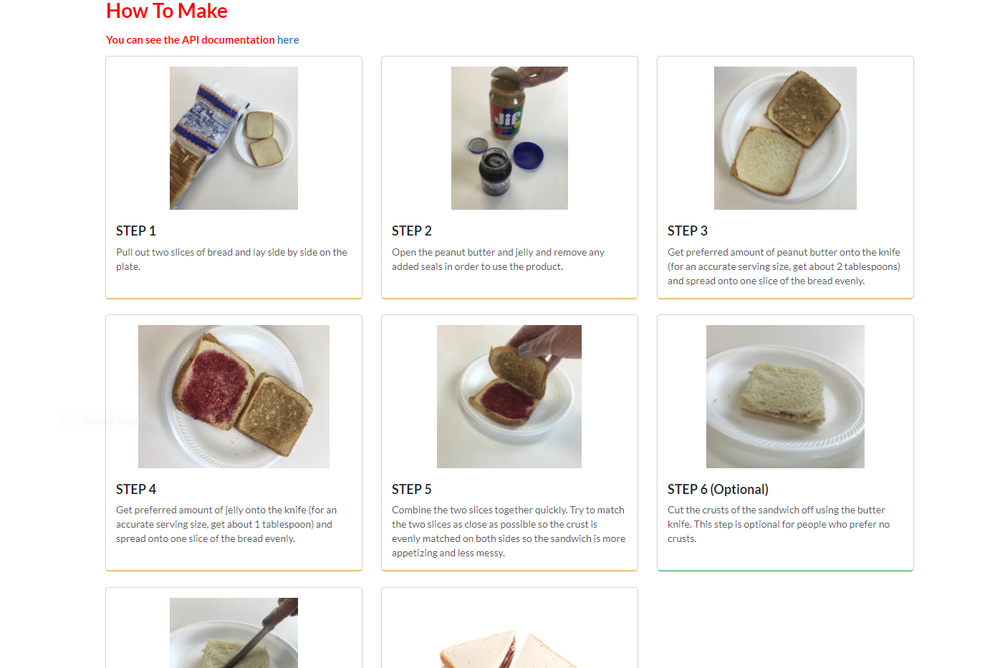

# Getting Started with this project

## About this project

This is a **`React`** self-project to show the skill of working with **API** calls.

---

## Prerequisite

You need to have [**node**](https://nodejs.org/en/) as well as [**npm**](https://nodejs.org/en/) installed on your machine

---

## Project setup

### Steps to successfully run this project

-   Install all the depenedencies using

    #### `npm install`

-   The project is ready to be run in a development mode using

    #### `npm start`

    Runs the app in the development mode.\
     Open [http://localhost:3000/](http://localhost:3000/) to view it in the browser.

    The page will reload if you make edits.\
     You will also see any lint errors in the console.

-   You can test your application using the

    #### `npm test`

    Launches the test runner in the interactive watch mode.\
     See the section about [running tests](https://facebook.github.io/create-react-app/docs/running-tests) for more information.

-   After making the required changes the production build of the project can be build using

    #### `npm run build`

    Builds the app for production to the `build` folder.\
     It correctly bundles React in production mode and optimizes the build for the best performance.

    The build is minified and the filenames include the hashes.\
     Your app is ready to be deployed!

    See the section about [deployment](https://facebook.github.io/create-react-app/docs/deployment) for more information.

### Project folders

-   **`client/public`** - contains the static files like `index.html`

-   **`client/src`** - contains all the `.js` files to render on the home page

---

## Project Image

Home Page
